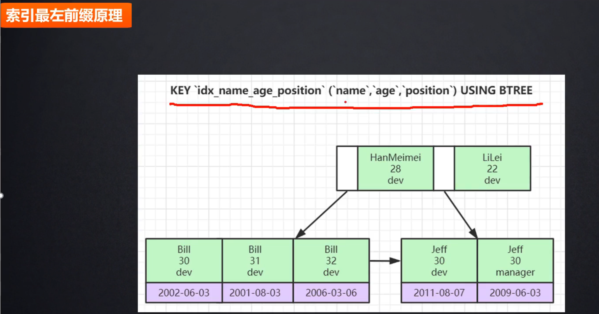

## 1 . 二叉搜索树

二叉搜索树，也称二叉搜索树，有序二叉树，排序二叉树，是指一棵空树或者具有下列性质的二叉树:

1. 左子树上所有结点的值均小于它的根节点的值
2. 右子树上所有结点的值均大于它的根节点的值
3. 以此类推，左右子树也分别为二叉查找树

中序遍历： 升序排列

## 2.平衡二叉树

平衡二叉树一般是一个有序树，它具有二叉树的所有性质，其遍历操作和二叉树的遍历操作相同。但是由于其对二叉树施加了额外限制，因而其添加、删除操作都必须保证平衡二叉树的因子被保持。

平衡二叉树中引入了一个概念：平衡二叉树节点的平衡因子，它指的是该节点的两个子树，即左子树和右子树的高度差，即用左子树的高度减去右子树的高度，如果该节点的某个子树不存在，则该子树的高度为0,如果高度差的绝对值超过1就要根据情况进行调整。

### 2.1 AVL树

#### 2.1.1基本概念

任意节点的左子树减去右子树的高度差绝对值小于等于1

#### 2.1.2旋转

左旋 （右右子树）

右旋（左左子树）

左右旋 （左右子树）

右左旋  （右左子树）

应该是从底向上看，找第一个【左右子树高度差】绝对值大于1（也就是超出平衡因子）的节点开始操作。

### 2.2 红黑树

#### 2.2.1 性质

读操作非常非常多，写操作非常非常少的情况下，用AVL树，比如数据库，微博等，写操作非常多或者插入和删除操作一半一半，读操作非常少用红黑树比如map，set等。

#### 红黑树和AVL 树比较

红黑树不追求"完全平衡"，即不像AVL那样要求节点的 `|balFact| <= 1`，它只要求部分达到平衡，但是提出了为节点增加颜色，红黑是用非严格的平衡来换取增删节点时候旋转次数的降低，任何不平衡都会在三次旋转之内解决，而AVL是严格平衡树，因此在增加或者删除节点的时候，根据不同情况，旋转的次数比红黑树要多。

就插入节点导致树失衡的情况，AVL和RB-Tree都是最多两次树旋转来实现复衡rebalance，旋转的量级是O(1)
 删除节点导致失衡，AVL需要维护从被删除节点到根节点root这条路径上所有节点的平衡，旋转的量级为O(logN)，而RB-Tree最多只需要旋转3次实现复衡，只需O(1)，所以说RB-Tree删除节点的rebalance的效率更高，开销更小！

AVL的结构相较于RB-Tree更为平衡，插入和删除引起失衡，如2所述，RB-Tree复衡效率更高；当然，由于AVL高度平衡，因此AVL的Search效率更高啦。

针对插入和删除节点导致失衡后的rebalance操作，红黑树能够提供一个比较"便宜"的解决方案，降低开销，是对search，insert ，以及delete效率的折衷，总体来说，RB-Tree的统计性能高于AVL.

故引入RB-Tree是**功能、性能、空间开销的折中结果**。
 5.1 AVL更平衡，结构上更加直观，时间效能针对读取而言更高；维护稍慢，空间开销较大。
 5.2 红黑树，读取略逊于AVL，维护强于AVL，空间开销与AVL类似，内容极多时略优于AVL，维护优于AVL。
 基本上主要的几种平衡树看来，**红黑树有着良好的稳定性和完整的功能，性能表现也很不错，综合实力强**，在诸如STL的场景中需要稳定表现。

## MYSQL 索引

### B树

红黑树随着数据量增大层高变大，（树的深度变大）

### B+树

叶子节电使用双指针连接范围查找方便

B树到B+树改进：

双向指针

冗余索引： 在高度相等的情况下面，B+树存储元素更多

#### 存储引擎（形容的表）

##### MyISAM

- 存储文件（后缀）
  - frm：存储表的基本结构信息，字段
  - MYD：存储的数据
  - MYI： 存储的索引

Myisam： 一条sql 语句，执行的时候先看有没有索引，如果先去MYI 里面查询，然后找到对应的磁盘文件地址 (0xF3)，去MYD 里面根据地址去磁盘里面把数据拿出来

##### Innodb

- 存储文件：
  - frm：表结构
  - ibd：索引+数据

DML（Data Manipulation Language，数据操作语言）：用于检索或者修改数据。 DELETE：用于从数据库中删除数据。 

DDL（Data Definition Language，数据定义语言）： 用于定义数据的结构，比如创建、修改或者删除数据库对象

innodb 如果不设置索引，会选择第一列能标识唯一性的数据建立b+树，如果所有字段都有重复值，mysql 会维护一个隐藏列

- 主键使用uuid 不好

  字符串比大小没有整型效率高，如果uuid 到最后一位才不一样，很崩溃

  

### 哈希索引

查找很快，但是取件查找不好

### 联合索引

下图只有第一条语句使用了索引，联合索引需要从第一个字段开始用，不然不走索引，为什么？

因为按name和age 排好序，

第二句按age=30查找，因为第二个age是无序的

Hash_number 散列到那些地方

在布隆过滤器存在的不一定真的存在，但是不存在就真的不存在