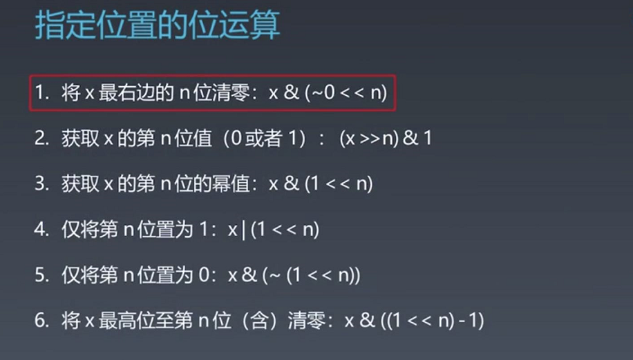

### 位运算符

| 含义                     | 运算符 | 示例                             |
| ------------------------ | ------ | -------------------------------- |
| 左移                     | <<     | 0011=>0110  相当于 n // 2        |
| 右移                     | >>     | 0110 =》0011                     |
| 按位或                   | \|     | 0011<br>1011<br>———<br>1011      |
| 按位与                   | &      | 0011<br>1011<br>-------<br>0011  |
| 按位取反                 | ~      | 0011   => 1100                   |
| 按位异或(相同为0不同为1) | ^      | 0011<br>1000<br>--------<br>1011 |

###  逻辑运算符

| 含义 | 运算符                                             |
| ---- | -------------------------------------------------- |
| `&&` | 逻辑 *AND*：两个操作数都为 true 时，结果为 true    |
| `||` | 逻辑 *OR*：一个或两个操作数为 true 时，结果为 true |
| `^^` | 逻辑 *XOR*：只有一个操作数为 true 时，结果为 true  |

### 高级

#### 异或: 相同为0，不同为1，也可用不进位加法来理解

异或操作的一些特点：

- x^0=x
- x^1s = ~x   1s=~0(-(0+1))
- x^(~x) = 1s
- x^x = 0
- 交换两个数  c = a^b  a^c=b   b^c=a   

#### 指定位置的位运算



### 实战

- 判断奇偶

  x%2==1  ==>  x&1 ==1

  `x%2==0  ==>  x&1==0`

- x>>1  ==>  X/2
- X=X&(x-1) 清零最低位的1
- X&-X   ===> 得到最低位的1
- X&~X ====> 0  

```
{
        "_index" : "proidm_config",
        "_type" : "_doc",
        "_id" : "8U4gE3kBnXIvDJPRM5j7",
        "_score" : 1.0,
        "_source" : {
          "module_type" : "system",
          "probi_op" : {
            "op_time" : "2021-03-28T17:57:07.171288",
            "op_user" : "test_admin",
            "op_status" : "U"
          },
          "module_tree" : {
            "node_level" : 0,
            "node_name" : "cas",
            "node_level_name" : "system",
            "node_name_fqdn" : "cas"
          },
          "module_name" : "cas",
          "config_name" : "CustomConfig",
          "config_set" : "{\"MasterData\": {\"CustomerIndex\": \"model_customer\", \"MasterAuth\": {\"username\": \"cas_account\", \"password\": \"shineclouD@2018\"}, \"MasterHost\": \"http://elasticsearch:9200\", \"MasterIndex\": \"stage_si_customer\", \"SiCustomerIndex\": \"model_si_customer\", \"name\": \"中央数据库\", \"type\": \"MasterData\"}, \"BU\": {\"name\": \"客户BU信息\", \"type\": \"BU\", \"BU\": [\"EP-I\", \"EP-E\", \"EP-I-APT\", \"EP-E-WA\", \"DG\", \"BP\", \"DS-SMVS\", \"VI\", \"DS-SSLS\", \"RSS\", \"SI\", \"DI\"]}, \"MyID\": {\"CRETPATH\": \"/prolliance/data/NG/www/ManagementSystem/saml/cret.cret\", \"MyIDConfigPATH\": \"/prolliance/data/NG/www/ManagementSystem/saml/settings.json\", \"name\": \"MyID配置\", \"type\": \"MyID\"}, \"CallApi\": {\"name\": \"调用外部api\", \"type\": \"CallApi\", \"SICUSTOMER\": \"https://www.e2e-test.siemens.com.cn/SICustomerApi/customer/list\", \"SI_APPID\": \"SICustomer_WeChat_Test\", \"SI_SECRETKEY\": \"6849ABFF5767457F88CFA0278D4BE965\", \"PPMCREATEUSER\": \"https://ppm.e2e-test.siemens.com.cn/api/User/Post_CreatePabUser/\", \"PPM_APPID\": \"PAB_E2E_Test\", \"PPM_SECRETKEY\": \"406B053FE1884F13BEF857770152E737\", \"PPM_TOKEN\": \"https://ppm.e2e-test.siemens.com.cn/api/Login/Post_GetToken/\", \"SI_TOKEN\": \"https://www.e2e-test.siemens.com.cn/SICustomerApi/user/gettoken\", \"PPM_TOKEN_EXP\": 1800, \"SI_REQUESTER\": \"WeChatApp\", \"SICREATECUSTOMSER\": \"https://www.e2e-test.siemens.com.cn/SICustomerApi/customer/simplecustomerrequest/\", \"SICREATECUSTOMSERDETAIL\": \"https://www.e2e-test.siemens.com.cn/SICustomerApi/customer/detail/\", \"SysCustomerPropertyCode\": \"PaB\", \"DataSource\": \"WeChat\", \"APPLETS_APPID\": \"3ED0A33CBFF5EB1180D2000C2919B43E\", \"APPLETS_SECRETKEY\": \"kBYy8JMIUEeCNldcM5P8aSNGyNag4ErtXjK0fG2ZeTU=\", \"APPLETS_TOKEN\": \"https://app.flowportalcloud.com:3333/api/Account/GetToken?appId={appid}&appSecret={secret}\", \"APPLETS_MESSAGE\": \"https://app.flowportalcloud.com:3333/api/Message/SendMessage/?token={token}\", \"AUTO_CREATE_USER_APP\": \"Project & Offer\", \"CHANGE_SI_ATTR\": \"https://www.e2e-test.siemens.com.cn//SICustomerApi/customer/sicustomerpropertyrequest/\"}}",
          "params" : "{\"MasterData\": {\"MasterHost\": {\"label\": {\"zh\": \"\\u4e2d\\u592e\\u6570\\u636e\\u5e93\\u63a5\\u53e3\", \"en\": \"Central database interface\"}, \"type\": \"keyword\", \"require\": true, \"allow_edit\": true, \"default\": \"\"}, \"username\": {\"label\": {\"zh\": \"\\u7528\\u6237\\u540d\", \"en\": \"username\"}, \"type\": \"keyword\", \"require\": true, \"allow_edit\": true, \"default\": \"\"}, \"password\": {\"label\": {\"zh\": \"\\u5bc6\\u7801\", \"en\": \"password\"}, \"type\": \"keyword\", \"require\": true, \"allow_edit\": true, \"default\": \"\"}, \"MasterIndex\": {\"label\": {\"zh\": \"\\u4e3b\\u6570\\u636e\\u7d22\\u5f15\", \"en\": \"master data index\"}, \"type\": \"keyword\", \"require\": true, \"allow_edit\": true, \"default\": \"\"}, \"SiCustomerIndex\": {\"label\": {\"zh\": \"\\u4f01\\u4e1a\\u4fe1\\u606f\\u5e93\", \"en\": \"Enterprise information base\"}, \"type\": \"keyword\", \"require\": true, \"allow_edit\": true, \"default\": \"\"}, \"CustomerIndex\": {\"label\": {\"zh\": \"\\u4f01\\u4e1a\\u7c7b\\u578b\\u5e93\", \"en\": \"Enterprise type library\"}, \"type\": \"keyword\", \"require\": true, \"allow_edit\": true, \"default\": \"\"}}, \"BU\": {\"BU\": {\"label\": {\"zh\": \"\\u5ba2\\u6237BU\\u4fe1\\u606f\", \"en\": \"Customer Bu information\"}, \"type\": \"list\", \"require\": true, \"allow_edit\": true, \"default\": \"\"}}, \"MyID\": {\"CRETPATH\": {\"label\": {\"zh\": \"MyID\\u8bc1\\u4e66\\u8def\\u5f84\", \"en\": \"MyID certificate path\"}, \"type\": \"keyword\", \"require\": true, \"allow_edit\": false, \"default\": \"\"}, \"MyIDConfigPATH\": {\"label\": {\"zh\": \"MyID\\u914d\\u7f6e\\u6587\\u4ef6\\u8def\\u5f84\", \"en\": \"MyID configuration file path\"}, \"type\": \"keyword\", \"require\": true, \"allow_edit\": false, \"default\": \"\"}}, \"CallApi\": {\"SICUSTOMER\": {\"label\": {\"zh\": \"SI \\u5ba2\\u6237\\u5e93API\", \"en\": \"Customer Bu information\"}, \"type\": \"keyword\", \"require\": true, \"allow_edit\": true, \"default\": \"\"}, \"SI_APPID\": {\"label\": {\"zh\": \"SI \\u5ba2\\u6237\\u5e93APPID\", \"en\": \"Customer Bu information\"}, \"type\": \"keyword\", \"require\": true, \"allow_edit\": true, \"default\": \"\"}, \"SI_SECRETKEY\": {\"label\": {\"zh\": \"SI \\u5ba2\\u6237\\u5e93 SECRETKEY\", \"en\": \"Customer Bu information\"}, \"type\": \"keyword\", \"require\": true, \"allow_edit\": true, \"default\": \"\"}, \"SI_TOKEN\": {\"label\": {\"zh\": \"SI \\u83b7\\u53d6token \\u63a5\\u53e3\", \"en\": \"Customer Bu information\"}, \"type\": \"keyword\", \"require\": true, \"allow_edit\": true, \"default\": \"\"}, \"PPMCREATEUSER\": {\"label\": {\"zh\": \"PPM \\u521b\\u5efa\\u7528\\u6237\\u63a5\\u53e3\", \"en\": \"Customer Bu information\"}, \"type\": \"keyword\", \"require\": true, \"allow_edit\": true, \"default\": \"\"}, \"PPM_APPID\": {\"label\": {\"zh\": \"PPM_APPID\", \"en\": \"Customer Bu information\"}, \"type\": \"keyword\", \"require\": true, \"allow_edit\": true, \"default\": \"\"}, \"PPM_SECRETKEY\": {\"label\": {\"zh\": \"PPM_SECRETKEY\", \"en\": \"Customer Bu information\"}, \"type\": \"keyword\", \"require\": true, \"allow_edit\": true, \"default\": \"\"}, \"PPM_TOKEN\": {\"label\": {\"zh\": \"PPM \\u83b7\\u53d6TOKEN \\u63a5\\u53e3\", \"en\": \"Customer Bu information\"}, \"type\": \"keyword\", \"require\": true, \"allow_edit\": true, \"default\": \"\"}, \"PPM_TOKEN_EXP\": {\"label\": {\"zh\": \"PPM TOKEN \\u65f6\\u6548\", \"en\": \"Customer Bu information\"}, \"type\": \"keyword\", \"require\": true, \"allow_edit\": true, \"default\": \"\"}, \"SI_REQUESTER\": {\"label\": {\"zh\": \"SI \\u5ba2\\u6237\\u7533\\u8bf7\\u4eba\", \"en\": \"Customer Bu information\"}, \"type\": \"keyword\", \"require\": true, \"allow_edit\": true, \"default\": \"\"}, \"SICREATECUSTOMSER\": {\"label\": {\"zh\": \"SI \\u5ba2\\u6237\\u7533\\u8bf7\\u5730\\u5740\", \"en\": \"Customer Bu information\"}, \"type\": \"keyword\", \"require\": true, \"allow_edit\": true, \"default\": \"\"}, \"SICREATECUSTOMSERDETAIL\": {\"label\": {\"zh\": \"SI \\u5ba2\\u6237\\u7533\\u8bf7\\u5ba2\\u6237\\u8be6\\u60c5\\u5730\\u5740\", \"en\": \"Customer Bu information\"}, \"type\": \"keyword\", \"require\": true, \"allow_edit\": true, \"default\": \"\"}, \"DataSource\": {\"label\": {\"zh\": \"\\u6570\\u636e\\u6765\\u6e90(SI \\u9700\\u8981)\", \"en\": \"Customer Bu information\"}, \"type\": \"keyword\", \"require\": true, \"allow_edit\": true, \"default\": \"\"}, \"APPLETS_APPID\": {\"label\": {\"zh\": \"\\u5c0f\\u7a0b\\u5e8f appid\", \"en\": \"Customer Bu information\"}, \"type\": \"keyword\", \"require\": true, \"allow_edit\": true, \"default\": \"\"}, \"APPLETS_SECRETKEY\": {\"label\": {\"zh\": \"\\u5c0f\\u7a0b\\u5e8f_SECRETKEY\", \"en\": \"Customer Bu information\"}, \"type\": \"keyword\", \"require\": true, \"allow_edit\": true, \"default\": \"\"}, \"APPLETS_TOKEN\": {\"label\": {\"zh\": \"\\u5c0f\\u7a0b\\u5e8f_\\u83b7\\u53d6token\", \"en\": \"Customer Bu information\"}, \"type\": \"keyword\", \"require\": true, \"allow_edit\": true, \"default\": \"\"}, \"APPLETS_MESSAGE\": {\"label\": {\"zh\": \"\\u5c0f\\u7a0b\\u5e8f\\u63a5\\u53d7\\u6d88\\u606fapi\", \"en\": \"APPLETS_MESSAGE\"}, \"type\": \"keyword\", \"require\": true, \"allow_edit\": true, \"default\": \"\"}, \"AUTO_CREATE_USER_APP\": {\"label\": {\"zh\": \"\\u81ea\\u52a8\\u521b\\u5efa\\u7528\\u6237\\u5e94\\u7528\", \"en\": \"AUTO_CREATE_USER_APP\"}, \"type\": \"keyword\", \"require\": true, \"allow_edit\": true, \"default\": \"\"}, \"CHANGE_SI_ATTR\": {\"label\": {\"zh\": \"\\u4fee\\u6539SI\\u5ba2\\u6237\\u5c5e\\u6027\", \"en\": \"AUTO_CREATE_USER_APP\"}, \"type\": \"keyword\", \"require\": true, \"allow_edit\": true, \"default\": \"\"}}}"
        }
      },
```