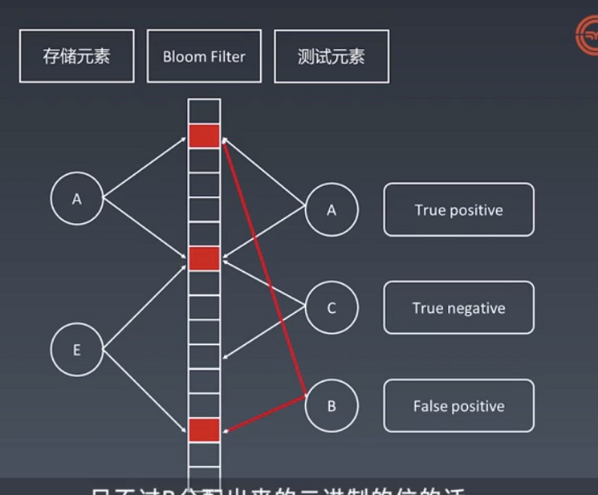
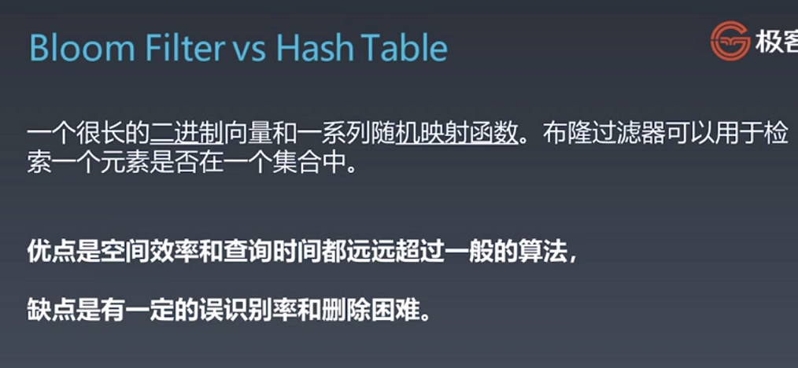
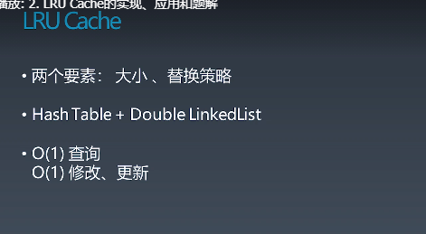
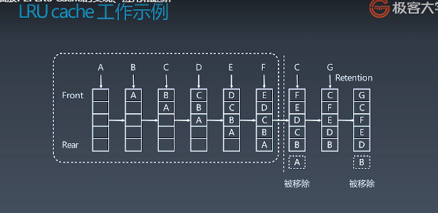

## 布隆过滤器

https://www.cnblogs.com/cpselvis/p/6265825.html

在布隆过滤器中如果不存在就是一定不存在，如果存在可能存在

## LRU Cache

LRU是Least Recently Used的缩写，即最近最少使用，是一种常用的[页面置换算法](https://baike.baidu.com/item/页面置换算法/7626091)，选择最近最久未使用的页面予以淘汰。该算法赋予每个[页面](https://baike.baidu.com/item/页面/5544813)一个访问字段，用来记录一个页面自上次被访问以来所经历的时间 t，当须淘汰一个页面时，选择现有页面中其 t 值最大的，即最近最少使用的页面予以淘汰。

